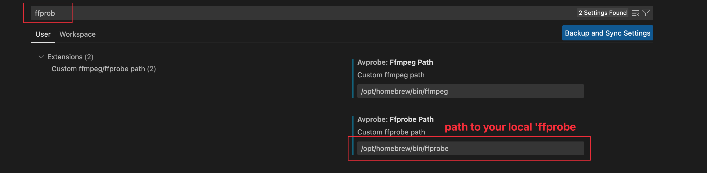

# AVProbe (VSCode Extension)
Show information of Audio/Video files via built-in ffmpeg/ffprobe.

## Features
* [x] Support mp4/mkv/mov and others
* [x] Show basic information(streams, formats and so on)
* [x] Show packets information in table
* [x] Better UI (vue3 + AntDesign for vue)
* [x] Responsive Webview
* [ ] Preview specified frame
* [ ] Dark theme for Dark mode

## How to use?

### 1. Config `ffprobe` path firstly

### 2. Open media files with 'AVProbe'
> Right click on the media file, and choose "Audio/Video Probe" to open it.

